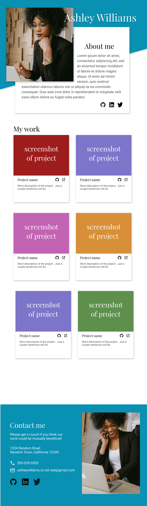

## Homepage
- Dummy Porfolio 

## Objective

- Apply what I have learned about the Web Content Accessibility Guidelines, semantic HTML, WAI-ARIA, and media queries while building a responsive homepage according to the specified design (The Odin Curriculum: https://www.theodinproject.com/lessons/node-path-advanced-html-and-css-homepage). 

## Features
- Optimized to meet WebAIM standards (WCAG 2.2)
- Implements semantics for assistive technology
- WAI-ARIA labels to enhance web assessibility for users when native labels and attributes aren't sufficient descriptors

## Codes
- HTML5
- CSS3
- Flexbox/Grid
- SVG icons

> ## Portfolio design
> ### Desktop  
> ### Tablet  
> ### Mobile  

See results [here](https://htmlpreview.github.io/?https://raw.githubusercontent.com/litnomad/homepage/refs/heads/main/index.html).
